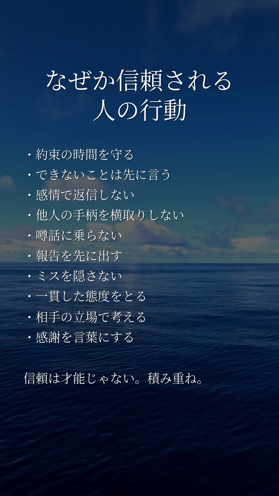

# ShortVideoMaker とは

Excel または Google スプレッドシートに入力したテキスト（タイトル・箇条書き）をもとに、縦型ショート動画（1080×1920）を自動生成するツールです。

**できること:**

- スプレッドシートの各行を1本の動画として一括生成
- タイトル＋箇条書きテキストを Pillow で画像化し、背景動画（mp4）へ ffmpeg でオーバーレイ合成
- エンディング動画を末尾に自動連結
- 複数チャンネル分の設定（YAML）をまとめて順番に実行（マルチチャンネル運用）
- 生成完了後、シートのステータス列を自動更新

**典型的なユースケース:** SNS・YouTube Shorts 向けの縦型スライド動画を、ネタ帳（スプレッドシート）から手間なく量産する。

---

# デモ

> スプレッドシートに文章を書くだけで、こんな動画が自動で生成されます。

<!-- TODO: デモ動画を追加 -->
<!-- 例:  -->
<!-- 例: https://github.com/user-attachments/assets/xxxxx -->

|                          入力（Excel or スプレッドシート）                          |                              出力（縦型ショート動画）                              |
|:-----------------------------------------------------------------------:|:----------------------------------------------------------------------:|
|  |  |

**生成の流れ（所要時間: 数十秒〜）:**

```
スプレッドシート記入  →  python -m svmu_multi.run  →  mp4 完成
      （ネタ帳）              （コマンド1つ）           （縦型動画）
```

---

# 環境セットアップ

## Windows での環境設定

### 1. 事前準備

- **Python 3.10+** をインストール
  - [python.org](https://www.python.org/downloads/) から取得し、インストール時に「Add Python to PATH」にチェックを入れる
  - インストール確認:
    ```powershell
    python --version
    ```
- **ffmpeg** を用意（いずれかの方法）
  - 方法A: [ffmpeg公式](https://ffmpeg.org/download.html) または `winget install ffmpeg` でシステムにインストールし PATH を通す
  - 方法B: `ffmpeg` を任意の場所に展開し（`.env` の `FFMPEG_PATH` で指定）

### 2. 仮想環境の作成と有効化（PowerShell）

```powershell
# プロジェクトルートに移動
cd C:\path\to\ShortVideoMaker

# 仮想環境を作成
python -m venv .venv

# 有効化（PowerShell）
.venv\Scripts\Activate.ps1
```

> **注意**: PowerShell の実行ポリシーによってはエラーになる場合があります。その場合は以下を実行してください（ユーザースコープのみ変更）。
> ```powershell
> Set-ExecutionPolicy -ExecutionPolicy RemoteSigned -Scope CurrentUser
> ```

コマンドプロンプト (cmd) の場合:
```cmd
.venv\Scripts\activate.bat
```

### 3. 依存関係のインストール

```powershell
pip install --upgrade pip
pip install -r requirements.txt
```

### 4. フォントの配置

日本語表示に必要なフォントを `assets/fonts/` に配置し、`.env` の `FONT_PATH` で指定します。

推奨: [Noto Serif CJK JP](https://fonts.google.com/noto/specimen/Noto+Serif+JP)（`NotoSerifCJKjp-Regular.otf`）

```
assets/
└─ fonts/
    └─ NotoSerifCJKjp-Regular.otf   ← ここに配置
```

### 5. 設定ファイルの準備

```powershell
# .env を作成
copy .env.example .env

# チャンネル設定サンプルをコピー（マルチチャンネル利用時）
copy channels\excel.yaml.example channels\my_channel.yaml
```

`.env` を開いて各値を編集してください（下記「環境変数一覧」を参照）。

### 6. 動作確認

```powershell
# Excel 利用時
python -m svmu.main --excel "./assets/ideas.xlsx" --sheet "Sheet1" --output ./outputs --limit 3

# Googleスプレッドシート利用時（USE_GOOGLE_SHEETS=true 設定済み）
python -m svmu.main --sheet "Sheet1" --output ./outputs --limit 3
```

---

## Linux での仮想環境 (venv) 構築手順

本プロジェクトは venv を使って開発環境を構築します。
以下は Linux (Ubuntu/Debian 系を想定) での基本的な手順です。

1) 事前準備
    - Python3 がインストールされていることを確認
      ```bash
      python3 --version
      ```
    - 必要であれば venv パッケージをインストール（Ubuntu/Debian）
      ```bash
      sudo apt update
      sudo apt install -y python3-venv
      ```

2) 仮想環境の作成（プロジェクト直下に .venv を作成）
   ```bash
   python3 -m venv .venv
   ```

3) 仮想環境の有効化
   ```bash
   source .venv/bin/activate
   ```
    - 有効化後、プロンプトに `(venv)` が表示されます。

4) 依存関係のインストール
   ```bash
   pip install --upgrade pip
   pip install -r requirements.txt
   ```

5) 動作確認（例）
   ```bash
   python -m svmu.main --sheet "Sheet1" --output ./outputs --limit 5
   ```
    - Excel を使う場合は `.env` で `USE_GOOGLE_SHEETS=false` を設定し、
      ```bash
      python -m svmu.main --excel "./assets/ideas.xlsx" --sheet "Sheet1" --output ./outputs --limit 5
      ```

6) 仮想環境の無効化
   ```bash
   deactivate
   ```

補足:

- `.venv/` は既に `.gitignore` に含まれており、リポジトリにコミットされません。
- 他ディストリビューションでも基本は同様です。`python3-venv` パッケージ名は環境により異なることがあります。

# ShortVideoMakeAndUpload

Excel/Googleスプレッドシートの各行から短尺の縦動画（1080x1920）を自動生成し、ffmpegで背景動画にテキストオーバーレイを合成。

## 特長

- データソースを選択可能: Excel（.xlsx）または Google スプレッドシート
- Pillowでタイトル＋箇条書きの縦型画像（1080x1920）をレンダリング
- ffmpegで背景動画（H.264）にテキスト画像を合成し、背景の音声は維持
- APP_ROOT/ending（または YAML/環境変数で指定した ENDING_VIDEO）配下に .mp4 があれば、生成動画の末尾に自動で連結（再エンコードでコーデック不整合を回避）
- 出力フォルダ・安全なファイル名で保存
- `.env` と YAML による環境変数・設定管理

## 必要環境

- Python 3.10+
- ffmpeg が PATH で利用可能であること
- フォント：日本語の明朝/セリフ系フォント（例：Noto Serif CJK JP）をご用意ください。`.env` の `FONT_PATH` で指定できます。
- フォント色・影は `.env` または YAML で指定できます（`TITLE_COLOR`, `BULLET_COLOR`, `TITLE_SHADOW`, `BULLET_SHADOW`,
  `SHADOW_OFFSET`）。色は #RRGGBB または #RRGGBBAA（アルファ付き）形式。未指定の文字色は白（#FFFFFF）、影はタイトル #000000B4・本文
  #000000A0、オフセットは 2,2 になります。

## 環境変数一覧

`.env` および `channels/*.yaml` で設定できる環境変数の一覧です。
YAML では `KEY: value` 形式、`.env` では `KEY=value` 形式で記述します。

### データソース

| 変数名 | 説明 | 必須/任意 | サンプル値 | デフォルト値 |
|:---|:---|:---|:---|:---|
| `USE_GOOGLE_SHEETS` | データソース選択。`true` でGoogleスプレッドシート、`false` でExcel | 任意 | `false` | `false` |
| `EXCEL_PATH` | Excelファイルのパス（`USE_GOOGLE_SHEETS=false` 時） | Excel利用時 必須 | `./assets/ideas.xlsx` | `./assets/ideas.xlsx` |
| `SHEET_NAME` | 読み込むシート名（Excel/Googleスプレッドシート共通） | 必須 | `Sheet1` | `Sheet1` |
| `GSHEET_SPREADSHEET_ID` | GoogleスプレッドシートのID（URLの `/d/` と `/edit` の間の文字列） | GSheet利用時 必須 | `1BxiMVs0XRA5nFMdKvBdBZjgmUUqptlbs74OgVE2upms` | なし |
| `GSHEET_SERVICE_ACCOUNT_JSON` | サービスアカウントJSONキーファイルのパス | GSheet利用時 必須 | `./credentials/service_account.json` | なし |

### 動画素材

| 変数名 | 説明 | 必須/任意 | サンプル値 | デフォルト値 |
|:---|:---|:---|:---|:---|
| `BACKGROUND_VIDEO` | 背景動画（`.mp4` ファイル、またはディレクトリ）。ディレクトリ指定時はランダムに1本選択 | 必須 | `./assets/backgrounds` | `./assets/background.mp4` |
| `ENDING_VIDEO` | エンディング動画を含むディレクトリ。最初に見つかった `.mp4` を末尾に連結。省略時は `./ending` を探索 | 任意 | `./ending` | `./ending` |
| `FFMPEG_PATH` | ffmpeg 実行ファイルのパス。省略時はシステムPATHの `ffmpeg` を使用 | 任意 | `/usr/local/bin/ffmpeg` | なし（システムPATH） |

### 出力

| 変数名 | 説明 | 必須/任意 | サンプル値 | デフォルト値 |
|:---|:---|:---|:---|:---|
| `OUTPUT_DIR` | 動画ファイルの出力先ディレクトリ | 任意 | `./outputs` | `./outputs` |

### フォント・スタイル

| 変数名 | 説明 | 必須/任意 | サンプル値 | デフォルト値 |
|:---|:---|:---|:---|:---|
| `FONT_PATH` | 使用するフォントファイルのパス（OTF/TTF） | 任意 | `./assets/fonts/NotoSerifCJKjp-Regular.otf` | `./assets/fonts/NotoSerifCJKjp-Regular.otf` |
| `TITLE_COLOR` | タイトルの文字色（`#RRGGBB` または `#RRGGBBAA`） | 任意 | `#FFFFFF` | `#FFFFFF` |
| `BULLET_COLOR` | 本文（箇条書き）の文字色（`#RRGGBB` または `#RRGGBBAA`） | 任意 | `#FFFFFF` | `#FFFFFF` |
| `TITLE_SHADOW` | タイトルの影色（`#RRGGBB` または `#RRGGBBAA`） | 任意 | `#000000B4` | `#000000B4`（黒70%） |
| `BULLET_SHADOW` | 本文の影色（`#RRGGBB` または `#RRGGBBAA`） | 任意 | `#000000A0` | `#000000A0`（黒62.7%） |
| `SHADOW_OFFSET` | 影のオフセット（ピクセル）。`x,y` 形式 | 任意 | `2,2` | `2,2` |

### ステータス文字列

| 変数名 | 説明 | 必須/任意 | サンプル値 | デフォルト値 |
|:---|:---|:---|:---|:---|
| `DEFAULT_STATUS_READY` | 処理対象とみなすステータス値 | 任意 | `Ready` | `Ready` |
| `DEFAULT_STATUS_DONE` | 処理完了後に書き込むステータス値 | 任意 | `Done` | `Done` |

---

## 設定の優先順位

設定値は以下の優先順位で上書きされます（上が高優先）:

1. **CLI オプション** (`--excel`, `--sheet`, `--output`, `--limit`)
2. **YAML** (`config.yaml` または `--config` で指定したファイル)
3. **`.env`** 環境変数
4. **コードのデフォルト値**

例: YAML に `OUTPUT_DIR: ./outputs/finance` と書けば、`.env` の `OUTPUT_DIR` より優先されます。

## クイックスタート

1. 依存関係をインストール:
   ```bash
   pip install -r requirements.txt
   ```
2. `.env.example` を `.env` にコピーして値を編集。
3. `/channnels/excel.yaml.example` や `/channnels/spreadsheets.yaml.example` を `{任意の名称}.yaml` にコピーして必要に応じて調整。
4. データソースの設定:
    - Excelを使う場合（デフォルト）: `.env` の `USE_GOOGLE_SHEETS=false`、`EXCEL_PATH` と `SHEET_NAME` を設定。
    - Googleスプレッドシートを使う場合: `.env` の `USE_GOOGLE_SHEETS=true` を設定し、以下を用意します。
        - `GSHEET_SPREADSHEET_ID` にスプレッドシートのIDを設定（URLの `/d/` と `/edit` の間の文字列）。
        - Google Cloud でサービスアカウントを作成し、JSON鍵を `./credentials/service_account.json` などに保存。
        - そのサービスアカウントのメールアドレスを対象スプレッドシートに「閲覧者」以上で共有。
        - 必要に応じて `.env` の `GSHEET_SERVICE_ACCOUNT_JSON` でJSONパスを変更できます。
5. シートの列（Excel/Google共通）を用意。既定で想定される列:

   | 列名 | 型 | 必須/任意 | 記載者 | 説明 |
   |:---|:---|:---|:---|:---|
   | `id` | 文字列/数値 | 任意 | ユーザー | 行の一意識別子。未入力の場合は行番号で代替 |
   | `title` | 文字列 | 必須 | ユーザー | 動画のタイトル。画像上部にセンタリングして表示 |
   | `bullets` | 文字列 | 必須 | ユーザー | 箇条書き本文。改行は `\n` または `・` 区切りで可。自動折り返し対応 |
   | `status` | 文字列 | 必須 | ユーザー/システム | `Ready` で処理対象。完了後にシステムが `Done` へ自動更新 |
   | `output_filename` | 文字列（拡張子なし） | 任意 | システム | 出力ファイル名のベース。動画生成後にシステムが自動書き込み |
   | `output_datetime` | 文字列 | 任意 | システム | 出力日時。`yyyy/mm/dd hh:mm:ss` 形式でシステムが自動書き込み |
   | `tags` | CSV 文字列 | 任意 | ユーザー | 将来拡張用タグ。現在ツールは参照しません |
   | `description` | 文字列 | 任意 | ユーザー | 補足説明。現在ツールは参照しません |
   | `issued` | 文字列 | 任意 | ユーザー | 投稿日時。ユーザーが手動で記入。ツールは読み書きしません |
   | `issue_status` | 文字列 | 任意 | ユーザー | 投稿ステータス（例: 投稿済み）。ユーザーが手動で管理。ツールは読み書きしません |

参考: 列は Excel/Google スプレッドシートのどちらでも同一名称で扱われます。既存ブックの書式（列幅・改行など）は保持され、値のみ更新します。

サンプル:

| id | title                       | bullets                              | status | output_filename | output_datetime | tags | description | issue_status |
|---:|:----------------------------|:-------------------------------------|:-------|:----------------|:----------------|:-----|:------------|--------------|
|  1 | １行あたり全角９文字以内。<br>１タイトル２行まで。 | １．１行あたり全角で１０～１８文字程度<br>２．１動画あたり１０行程度 | Ready  |                 |                 |      |             |              | 

6. 背景動画（mp4）を用意し、`.env` の `BACKGROUND_VIDEO` にパスを設定します。

7. 実行（生成→合成→シート更新）:
    - Excel利用時:
      ```bash
      python -m svmu.main --excel "$EXCEL_PATH" --sheet "Sheet1" --output ./outputs --limit 5
      ```
    - Googleスプレッドシート利用時（`USE_GOOGLE_SHEETS=true` 設定済み）:
      ```bash
      python -m svmu.main --sheet "Sheet1" --output ./outputs --limit 5
      ```

## エンディング動画の自動付与

- 既定ではプロジェクト直下の `ending/` ディレクトリに `.mp4` があれば、生成動画の末尾に自動で連結されます。
- `ENDING_VIDEO`（YAML もしくは `.env`）を設定すると、探索ディレクトリを上書きできます。
    - 例: `ENDING_VIDEO: ./branding/outros`（YAML） もしくは `ENDING_VIDEO=./branding/outros`（.env）
- 複数の `.mp4` がある場合は、（再帰的に探索した上で）ファイル名の昇順で最初に見つかった 1 つを使用します。
- 連結は ffmpeg の concat フィルタで再エンコード（H.264, yuv420p, CRF=20, preset=medium）して行い、コーデック不整合による失敗を避けます。
- 無効化したい場合は、指定ディレクトリ（既定は `ending/`）から `.mp4` を取り除いてください。
- ffmpeg パスは `.env` の `FFMPEG_PATH` で指定できます（未指定時はシステムの `ffmpeg` を使用）。

例: ディレクトリ構成

```
ShortVideoMaker/
 ├─ ending/
 │   └─ my_outro.mp4   # ← これが自動で末尾に連結されます
 ├─ assets/
 ├─ svmu/
 └─ ...
```

## マルチチャンネル運用（YAML をチャンネルごとに配置）

複数のチャンネル設定を、プロジェクト直下の `channels/` ディレクトリに YAML として置き、まとめて順番に実行できます。

- ディレクトリ: `./channels/`
- ファイル: `*.yaml` または `*.yml`（例: `finance.yaml`, `english.yaml`）
- サンプル: `channels/channel.sample.yaml`

実行方法:

```bash
# 乾燥実行（一覧のみ）
python -m svmu_multi.run --dry-run

# 実行（見つかった YAML を順に実行）
python -m svmu_multi.run

# 1チャンネルあたりの最大処理件数を制限（例: 3件）
python -m svmu_multi.run --limit 3

# channels ディレクトリを変更
python -m svmu_multi.run --channels-dir ./my_channels
```

各チャンネルの YAML は `.env` と同じキーを上書きできます。例:

```yaml
USE_GOOGLE_SHEETS: true
GSHEET_SPREADSHEET_ID: "YOUR_SHEET_ID"
SHEET_NAME: "YourSheetName"
BACKGROUND_VIDEO: ./assets/backgrounds/bg1.mp4
OUTPUT_DIR: ./outputs/finance
ENDING_VIDEO: ./ending  # エンディング用のディレクトリ（省略時は ./ending）
TITLE_COLOR: "#000000"  # タイトルの文字色（例）
BULLET_COLOR: "#FFAA00"  # 本文の文字色（例）
TITLE_SHADOW: "#000000B4"  # タイトル影の色（例: 黒70%）
BULLET_SHADOW: "#000000A0"  # 本文影の色（例: 黒62.7%）
SHADOW_OFFSET: "2,2"        # 影のずらし量（x,y）
DEFAULT_STATUS_READY: Ready
DEFAULT_STATUS_DONE: Done
```

### 定期実行（cron / タスクスケジューラ）

- Linux (cron):
  ```cron
  # 毎時 10分に全チャンネルを実行（venv を使う例）
  10 * * * * cd /path/to/ShortVideoMaker && /path/to/venv/bin/python -m svmu_multi.run --limit 5 >> logs/multi.log 2>&1
  ```

- Windows (タスク スケジューラ):
    - プログラム/スクリプト: `C:\Path\To\python.exe`
    - 引数の追加: `-m svmu_multi.run --limit 5`
    - 開始 (作業) ディレクトリ: `C:\path\to\ShortVideoMaker`
    - もしくは PowerShell で手動起動:
      ```powershell
      cd C:\path\to\ShortVideoMaker
      python -m svmu_multi.run --limit 5
      ```

注意: 各 YAML は個別に `OUTPUT_DIR` を変えておくと出力が混在しません。

## 補足

- ログ: 標準出力に表示。将来的にファイル/JSONログ対応を検討しています。

