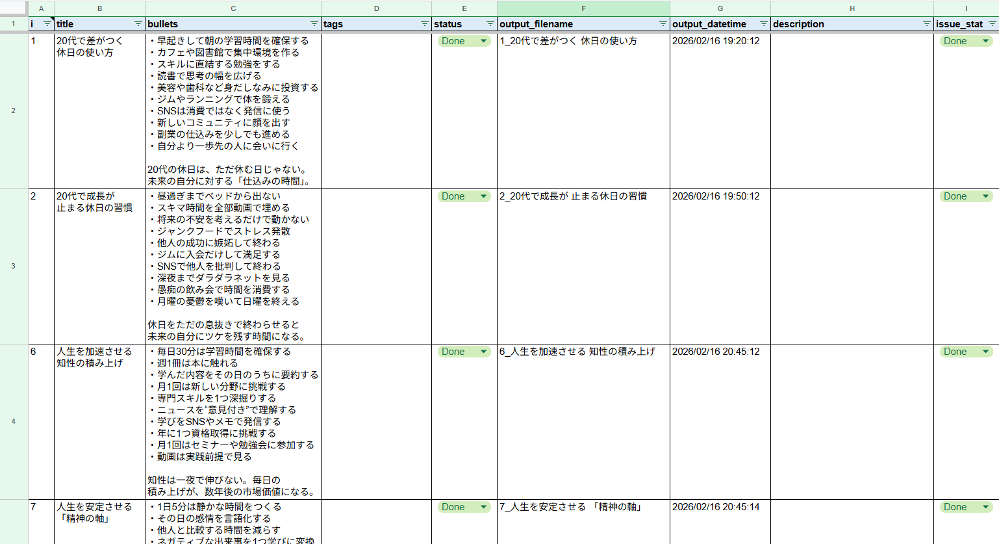

# ShortVideoMaker


Excel または Google スプレッドシートに入力したテキスト（タイトル・箇条書き）をもとに、縦型ショート動画（1080×1920）を自動生成するPythonツールです。

**できること:**

- スプレッドシートの各行を1本の動画として一括生成
- タイトル＋箇条書きテキストを Pillow で画像化し、背景動画（mp4）へ ffmpeg でオーバーレイ合成
- エンディング動画を末尾に自動連結
- 複数チャンネル分の設定（YAML）をまとめて順番に実行（マルチチャンネル運用）
- 生成完了後、シートのステータス列を自動更新

**典型的なユースケース:** SNS・YouTube Shorts 向けの縦型スライド動画を、ネタ帳（スプレッドシート）から手間なく量産する。

---

## デモ

> スプレッドシートに文章を書くだけで、こんな動画が自動で生成されます。

<!-- TODO: デモ動画を追加 -->
<!-- 例:  -->

|                          入力（Excel or スプレッドシート）                          |                              出力（縦型ショート動画）                              |
|:-----------------------------------------------------------------------:|:----------------------------------------------------------------------:|
|  |  |

**生成の流れ（所要時間: 数十秒〜）:**

```
スプレッドシート記入  →  python -m svmu_multi.run  →  mp4 完成
      （ネタ帳）              （コマンド1つ）           （縦型動画）
```

---

## クイックスタート

1. 依存関係をインストール:
   ```bash
   pip install -r requirements.txt
   ```

2. `.env.example` を `.env` にコピーして値を編集。

3. `channels/excel.yaml.example` を `channels/{任意の名称}.yaml` にコピーして必要に応じて調整。

4. データソースの設定:
   - **Excel を使う場合（デフォルト）**: `.env` の `USE_GOOGLE_SHEETS=false`、`EXCEL_PATH` と `SHEET_NAME` を設定。
   - **Google スプレッドシートを使う場合**: `.env` の `USE_GOOGLE_SHEETS=true` を設定し、以下を用意:
     - `GSHEET_SPREADSHEET_ID` にスプレッドシートのIDを設定（URLの `/d/` と `/edit` の間の文字列）
     - Google Cloud でサービスアカウントを作成し、JSON鍵を `./credentials/service_account.json` などに保存
     - そのサービスアカウントのメールアドレスを対象スプレッドシートに「閲覧者」以上で共有

5. シートの列を用意（[シート列仕様](#シート列仕様)参照）。

6. 背景動画（mp4）を用意し、`.env` の `BACKGROUND_VIDEO` にパスを設定。

7. 実行:
   ```bash
   # Excel 利用時
   python -m svmu.main --excel "$EXCEL_PATH" --sheet "Sheet1" --output ./outputs --limit 5

   # Google スプレッドシート利用時
   python -m svmu.main --sheet "Sheet1" --output ./outputs --limit 5

   # マルチチャンネル一括実行
   python -m svmu_multi.run
   ```

---

## 環境セットアップ

<details>
<summary>Windows セットアップ手順</summary>

### 1. 事前準備

- **Python 3.10+** をインストール
  - [python.org](https://www.python.org/downloads/) から取得し、インストール時に「Add Python to PATH」にチェックを入れる
  - インストール確認:
    ```powershell
    python --version
    ```
- **ffmpeg** を用意（いずれかの方法）
  - 方法A: [ffmpeg公式](https://ffmpeg.org/download.html) または `winget install ffmpeg` でシステムにインストールし PATH を通す
  - 方法B: `ffmpeg` を任意の場所に展開し、`.env` の `FFMPEG_PATH` で指定

### 2. 仮想環境の作成と有効化

```powershell
cd C:\path\to\ShortVideoMaker
python -m venv .venv
.venv\Scripts\Activate.ps1
```

> **注意**: PowerShell の実行ポリシーによってはエラーになる場合があります。その場合は以下を実行してください（ユーザースコープのみ変更）。
> ```powershell
> Set-ExecutionPolicy -ExecutionPolicy RemoteSigned -Scope CurrentUser
> ```

コマンドプロンプト (cmd) の場合:
```cmd
.venv\Scripts\activate.bat
```

### 3. 依存関係のインストール

```powershell
pip install --upgrade pip
pip install -r requirements.txt
```

### 4. フォントの配置

日本語表示に必要なフォントを `assets/fonts/` に配置し、`.env` の `FONT_PATH` で指定します。

推奨: [Noto Serif CJK JP](https://fonts.google.com/noto/specimen/Noto+Serif+JP)（`NotoSerifCJKjp-Regular.otf`）

```
assets/
└─ fonts/
    └─ NotoSerifCJKjp-Regular.otf   ← ここに配置
```

### 5. 設定ファイルの準備

```powershell
copy .env.example .env
copy channels\excel.yaml.example channels\my_channel.yaml
```

`.env` を開いて各値を編集してください（[環境変数一覧](#環境変数一覧)参照）。

### 6. 動作確認

```powershell
python -m svmu.main --excel "./assets/ideas.xlsx" --sheet "Sheet1" --output ./outputs --limit 3
```

</details>

<details>
<summary>Linux セットアップ手順</summary>

1. Python3 がインストールされていることを確認:
   ```bash
   python3 --version
   ```

2. 必要であれば venv パッケージをインストール（Ubuntu/Debian）:
   ```bash
   sudo apt update
   sudo apt install -y python3-venv
   ```

3. 仮想環境の作成と有効化:
   ```bash
   python3 -m venv .venv
   source .venv/bin/activate
   ```

4. 依存関係のインストール:
   ```bash
   pip install --upgrade pip
   pip install -r requirements.txt
   ```

5. 動作確認:
   ```bash
   python -m svmu.main --sheet "Sheet1" --output ./outputs --limit 5
   # Excel を使う場合は USE_GOOGLE_SHEETS=false を設定した上で:
   python -m svmu.main --excel "./assets/ideas.xlsx" --sheet "Sheet1" --output ./outputs --limit 5
   ```

> `.venv/` は `.gitignore` に含まれており、リポジトリにコミットされません。

</details>

---

## 設定リファレンス

### 環境変数一覧

`.env` および `channels/*.yaml` で設定できる環境変数の一覧です（YAML は `KEY: value` 形式、`.env` は `KEY=value` 形式）。

#### データソース

| 変数名 | 説明 | 必須/任意 | デフォルト値 |
|:---|:---|:---|:---|
| `USE_GOOGLE_SHEETS` | `true` でGoogleスプレッドシート、`false` でExcel | 任意 | `false` |
| `EXCEL_PATH` | Excelファイルのパス | Excel利用時 必須 | `./assets/ideas.xlsx` |
| `SHEET_NAME` | 読み込むシート名 | 必須 | `Sheet1` |
| `GSHEET_SPREADSHEET_ID` | GoogleスプレッドシートのID | GSheet利用時 必須 | なし |
| `GSHEET_SERVICE_ACCOUNT_JSON` | サービスアカウントJSONキーファイルのパス | GSheet利用時 必須 | なし |

#### 動画素材

| 変数名 | 説明 | 必須/任意 | デフォルト値 |
|:---|:---|:---|:---|
| `BACKGROUND_VIDEO` | 背景動画（`.mp4` またはディレクトリ）。ディレクトリ指定時はランダムに1本選択 | 必須 | `./assets/background.mp4` |
| `ENDING_VIDEO` | エンディング動画を含むディレクトリ | 任意 | `./ending` |
| `FFMPEG_PATH` | ffmpeg 実行ファイルのパス | 任意 | システムPATH |

#### 出力

| 変数名 | 説明 | 必須/任意 | デフォルト値 |
|:---|:---|:---|:---|
| `OUTPUT_DIR` | 動画ファイルの出力先ディレクトリ | 任意 | `./outputs` |

#### フォント・スタイル

| 変数名 | 説明 | 必須/任意 | デフォルト値 |
|:---|:---|:---|:---|
| `FONT_PATH` | フォントファイルのパス（OTF/TTF） | 任意 | `./assets/fonts/NotoSerifCJKjp-Regular.otf` |
| `TITLE_COLOR` | タイトルの文字色（`#RRGGBB` または `#RRGGBBAA`） | 任意 | `#FFFFFF` |
| `BULLET_COLOR` | 本文（箇条書き）の文字色 | 任意 | `#FFFFFF` |
| `TITLE_SHADOW` | タイトルの影色 | 任意 | `#000000B4`（黒70%） |
| `BULLET_SHADOW` | 本文の影色 | 任意 | `#000000A0`（黒62.7%） |
| `SHADOW_OFFSET` | 影のオフセット（`x,y` 形式） | 任意 | `2,2` |

#### ステータス文字列

| 変数名 | 説明 | 必須/任意 | デフォルト値 |
|:---|:---|:---|:---|
| `DEFAULT_STATUS_READY` | 処理対象とみなすステータス値 | 任意 | `Ready` |
| `DEFAULT_STATUS_DONE` | 処理完了後に書き込むステータス値 | 任意 | `Done` |

### 設定の優先順位

設定値は以下の優先順位で上書きされます（上が高優先）:

1. **CLI オプション** (`--excel`, `--sheet`, `--output`, `--limit`)
2. **YAML** (`channels/*.yaml`)
3. **`.env`** 環境変数
4. **コードのデフォルト値**

### シート列仕様

Excel/Google スプレッドシートで使用する列の一覧です。

| 列名 | 型 | 必須/任意 | 記載者 | 説明 |
|:---|:---|:---|:---|:---|
| `id` | 文字列/数値 | 任意 | ユーザー | 行の一意識別子。未入力の場合は行番号で代替 |
| `title` | 文字列 | 必須 | ユーザー | 動画のタイトル。画像上部にセンタリングして表示 |
| `bullets` | 文字列 | 必須 | ユーザー | 箇条書き本文。改行は `\n` または `・` 区切りで可。自動折り返し対応 |
| `status` | 文字列 | 必須 | ユーザー/システム | `Ready` で処理対象。完了後に `Done` へ自動更新 |
| `output_filename` | 文字列（拡張子なし） | 任意 | システム | 出力ファイル名。生成後に自動書き込み |
| `output_datetime` | 文字列 | 任意 | システム | 出力日時（`yyyy/mm/dd hh:mm:ss`）。生成後に自動書き込み |
| `tags` | CSV 文字列 | 任意 | ユーザー | 将来拡張用タグ。現在は参照しません |
| `description` | 文字列 | 任意 | ユーザー | 補足説明。現在は参照しません |
| `issued` | 文字列 | 任意 | ユーザー | 投稿日時。ユーザーが手動で記入 |
| `issue_status` | 文字列 | 任意 | ユーザー | 投稿ステータス。ユーザーが手動で管理 |

**入力例:**

| id | title | bullets | status |
|---:|:---|:---|:---|
| 1 | １行あたり全角９文字以内。<br>１タイトル２行まで。 | １．１行あたり全角で１０～１８文字程度<br>２．１動画あたり１０行程度 | Ready |

---

## 機能詳細

### エンディング動画の自動付与

`ending/` ディレクトリに `.mp4` があれば、生成動画の末尾に自動で連結します。

- `ENDING_VIDEO`（YAML または `.env`）でディレクトリを変更可能
- 複数の `.mp4` がある場合はファイル名昇順で最初の1つを使用
- ffmpeg の concat フィルタで再エンコード（H.264, yuv420p, CRF=20）し、コーデック不整合を回避
- 無効化する場合は `ending/` から `.mp4` を取り除く

```
ShortVideoMaker/
 ├─ ending/
 │   └─ my_outro.mp4   ← 自動で末尾に連結
 ├─ assets/
 └─ ...
```

### マルチチャンネル運用

`channels/` ディレクトリに YAML ファイルをチャンネルごとに配置し、一括実行できます。

```bash
python -m svmu_multi.run --dry-run              # 乾燥実行（一覧のみ）
python -m svmu_multi.run                        # 実行
python -m svmu_multi.run --limit 3              # 1チャンネルあたり最大3件
python -m svmu_multi.run --channels-dir ./my_channels  # ディレクトリ変更
```

YAML 設定例 (`channels/my_channel.yaml`):

```yaml
USE_GOOGLE_SHEETS: true
GSHEET_SPREADSHEET_ID: "YOUR_SHEET_ID"
SHEET_NAME: "YourSheetName"
BACKGROUND_VIDEO: ./assets/backgrounds/bg1.mp4
OUTPUT_DIR: ./outputs/my_channel
TITLE_COLOR: "#000000"
BULLET_COLOR: "#FFAA00"
```

> 各チャンネルの `OUTPUT_DIR` を変えておくと出力が混在しません。

### 定期実行

**Linux (cron):**

```cron
# 毎時10分に全チャンネルを実行（venv を使う例）
10 * * * * cd /path/to/ShortVideoMaker && /path/to/venv/bin/python -m svmu_multi.run --limit 5 >> logs/multi.log 2>&1
```

**Windows (タスク スケジューラ):**

- プログラム/スクリプト: `C:\Path\To\python.exe`
- 引数の追加: `-m svmu_multi.run --limit 5`
- 開始（作業）ディレクトリ: `C:\path\to\ShortVideoMaker`

---

## ライセンス

[MIT License](LICENSE)